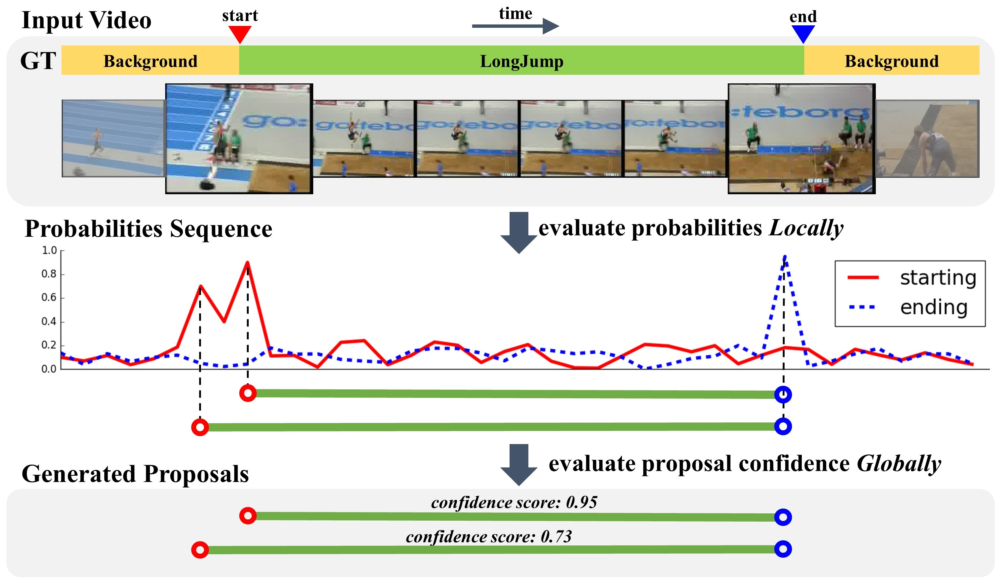

# BSN-boundary-sensitive-network

This repo holds the codes of paper: "BSN: Boundary Sensitive Network for Temporal Action Proposal Generation" 

[[Arxiv Preprint]](http://arxiv.org/abs/1806.02964)

# Update

* 2018.07.02: Repository for BSN


# Contents

* [Paper Introduction](#paper-introduction)
* [Other Info](#other-info)


# Paper Introduction

 

Temporal action proposal generation is an important yet challenging problem, since temporal proposals with rich action content are indispensable for analysing real-world videos with long duration and high proportion irrelevant content. This problem requires methods not only generating proposals with precise temporal boundaries, but also retrieving proposals to cover truth action instances with high recall and high overlap using relatively fewer proposals. To address these difficulties, we introduce an effective proposal generation method, named Boundary-Sensitive Network (BSN), which adopts “local to global” fashion. Locally, BSN first locates temporal boundaries with high probabilities, then directly combines these boundaries as proposals. Globally, with Boundary-Sensitive Proposal feature, BSN retrieves proposals by evaluating the confidence of whether a proposal contains an action within its region. We conduct experiments on two challenging datasets: ActivityNet-1.3 and THUMOS14, where BSN outperforms other state-of-the-art temporal action proposal generation methods with high recall and high temporal precision. Finally, further experiments demonstrate that by combining existing action classifiers, our method significantly improves the state-of-the-art temporal action detection performance.

# Other Info

## Citation


Please cite the following paper if you feel SSN useful to your research

```
@inproceedings{BSN2018arXiv,
  author    = {Tianwei Lin and
               Xu Zhao and
               Haisheng Su and
               Chongjing Wang and
               Ming Yang},
  title     = {BSN: Boundary Sensitive Network for Temporal Action Proposal Generation},
  booktitle   = {arXiv:1806.02964},
  year      = {2018},
}
```


## Contact
For any question, please file an issue or contact
```
Tianwei Lin: wzmsltw@sjtu.edu.cn
```